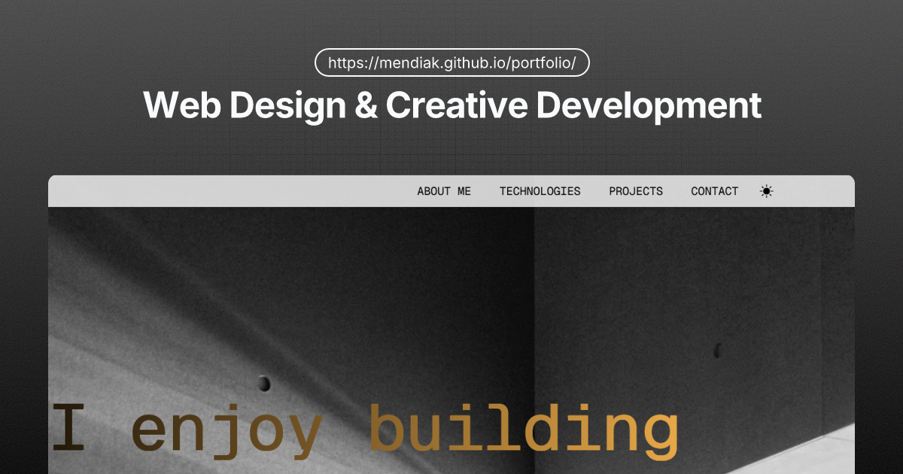

# Mikel Aramendia · Portfolio
### [mendiak.github.io/portfolio](https://mendiak.github.io/portfolio/)



A personal web sanctuary and experimental playground focused on **Swiss Design** principles: minimalism, modularity, and typographic clarity. Built with a "Vanilla First" philosophy.

---

## 📐 Design Philosophy
This project is an exploration of the **International Typographic Style**. It prioritizes:
- **Modular Grids:** Systematic layouts that ensure visual balance.
- **Minimalist Aesthetic:** Stripping away the unnecessary to let content speak.
- **Interactive Nuance:** Subtle, purposeful motion that enhances rather than distracts.

## 🚀 Key Features
- **Custom i18n Engine:** A lightweight, vanilla JavaScript translation system supporting English and Spanish.
- **Interactive Motion:** Smooth, scroll-triggered animations powered by **GSAP**.
- **Dark Mode:** A refined theme system with manual override and system preference detection.
- **Open Source Showcase:** Integrated GitHub connectivity for featured projects.
- **Responsive Architecture:** Fluid layouts designed to be readable across all viewport scales.

## 🛠️ Tech Stack
- **Languages:** HTML5, CSS3 (Custom Properties), JavaScript (ES6+).
- **Libraries:** [GSAP](https://greensock.com/gsap/) (ScrollTrigger), [Bootstrap Icons](https://icons.getbootstrap.com/).
- **Tools:** Spotlight.js for immersive image galleries.

## 📂 Project Structure
```text
├── assets/         # Optimized webp images and assets
├── locales/        # i18n JSON translation files
├── i18n.js         # Custom translation engine
├── script.js       # Main interactive logic
├── styles.css      # Swiss Design system & variables
└── index.html      # Semantic document structure
```

## ⌨️ Development
Clone the repository and serve the root directory using any local server (like VS Code's Live Server):

```bash
git clone https://github.com/Mendiak/portfolio.git
cd portfolio
```

## 📄 License
This project is open-source and available under the [MIT License](./LICENSE).

---
*Created by [Mikel Aramendia](https://www.linkedin.com/in/mikel-aramendia-lacalle/)*
